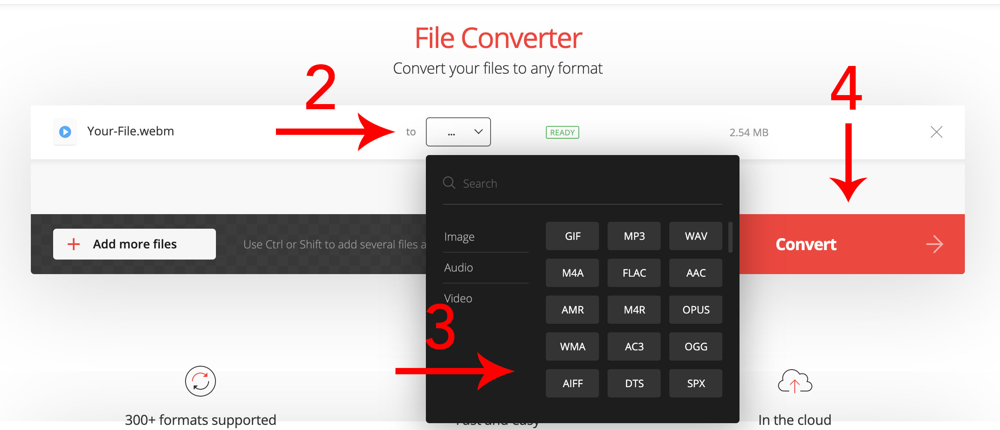

# Rendering Tips
Hubble offers the following options to render your visualizations:
- GIF
- WebM video
- PNG sequence
- JPEG sequence

If you would like to use the exports in a presentation we recommend the following steps:

### GIF
Usable as is. Feel free to add it to your presentation, notebook, or showcase!

### Convert WebM
There are plenty of free converters out there. The ones written in this guide will be based off of: https://convertio.co/

**Step 1: Pick your WebM file**

**Step 2: Click the "..." option to open up a menu**

**Step 3: Select the filetype that you want. We recommend GIF/MP4 for use in your presentations**

**Step 4: Click Convert**

### Convert JPEG sequence to GIF
There are plenty of free converters out there. The ones written in this guide will be based off of: https://gifmaker.me/

**Step 1: Untar the file. On Windows a tool like [7-Zip](https://www.7-zip.org/) can be used**

**Step 2: Click on Upload Images**

**Step 3: Select all the images in the folder that was created**

**Step 4: Open all the images**

**Step 4a: A preview will be generated at the top. Settings such as order and pacing can be adjusted if anything looks wrong**

**Step 5: Click on "Create GIF Animation"**

**Step 6: Click on "Download the GIF"**

### Convert PNG sequence to GIF
See "Convert JPEG sequence to GIF" section